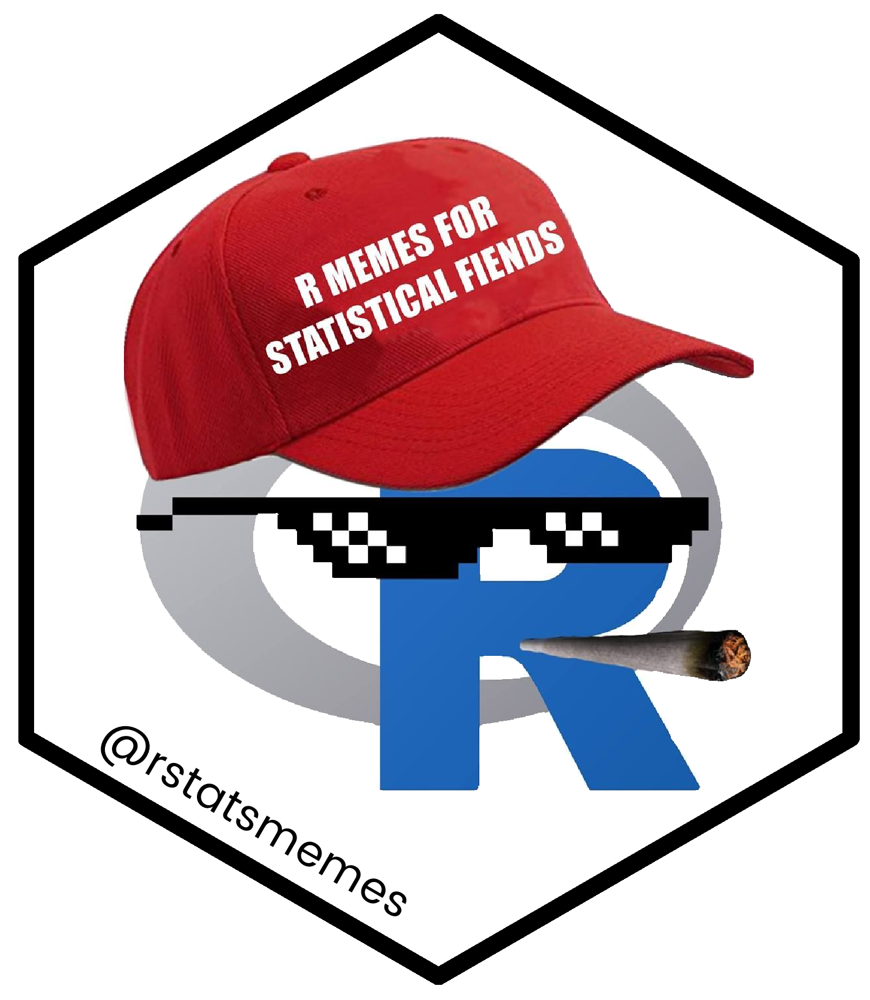

# R Memes for Statistical Fiends 

```{r setup, include=FALSE}
knitr::opts_chunk$set(echo = TRUE, fig.width = 10, fig.height = 10, results = "asis")

library(rstatsmemes)
library(tidyverse)

set.seed(252)
```

Ever wanted to have R Memes at the ready whenever you want? 

*Of course not.* But here is a package that does exactly that.

Find us on: 

<!-- Please don't remove this: Grab your social icons from https://github.com/carlsednaoui/gitsocial -->

<!-- display the social media buttons in your README -->

[![alt text][1.1]][1]
[![alt text][2.1]][2]
[![alt text][3.1]][3]
[![alt text][4.1]][4]

<!-- links to social media icons -->
<!-- no need to change these -->

<!-- icons with padding -->

[1.1]: http://i.imgur.com/tXSoThF.png (Twitter Meme account: @rstatsmemes)
[2.1]: http://i.imgur.com/P3YfQoD.png (Facebook Meme account)
[3.1]: http://i.imgur.com/0o48UoR.png (GitHub Repository: rstatsmemes)
[4.1]: https://i.imgur.com/VMlWYt8.png (Subreddit: r/rstatsmemes)


<!-- icons without padding -->

[1.2]: http://i.imgur.com/wWzX9uB.png (twitter icon without padding)
[2.2]: http://i.imgur.com/fep1WsG.png (facebook icon without padding)
[3.2]: http://i.imgur.com/9I6NRUm.png (github icon without padding)
[4.2]: https://i.imgur.com/VMlWYt8.png (github icon with padding)


<!-- links to your social media accounts -->
<!-- update these accordingly -->

[1]: http://www.twitter.com/rstatsmemes
[2]: http://www.facebook.com/rmemes0
[3]: https://github.com/favstats/rstatsmemes
[4]: https://www.reddit.com/r/rstatsmemes/

<!-- Please don't remove this: Grab your social icons from https://github.com/carlsednaoui/gitsocial -->


## Installation

The package is easy to use.

Just install package from GitHub:

```{r, eval = F}
devtools::install_github("favstats/rstatsmemes")
```


## Show Me an R Meme

Let `show_me_an_R_meme` do the rest. This will plot a random R meme from the list of all memes.

```{r, results = "asis"}
show_me_an_R_meme(random_meme = T)
```

Want to check out a list of all memes? You can do this here:

```{r, results='markup'}
glimpse(rstatsmemes::meme_posts)
```


You can also display a specific meme by passing a number from 1 to `r nrow(meme_posts)` (current number of memes on the Facebook page). The number refers to the date when the meme was first posted on Facebook with 1 being the first meme.

```{r}
show_me_an_R_meme(322)
```


## Top 3 Memes

Here are the Top 3 liked memes on the Facebook page:

```{r}
meme_indices <- meme_posts %>% 
  mutate(likes_count = as.numeric(likes_count)) %>% 
  arrange(desc(likes_count)) %>% 
  slice(1:3) %>% 
  pull(meme_number)
```

```{r}
show_me_an_R_meme(meme_indices[1])
```

```{r}
show_me_an_R_meme(meme_indices[2])
```

```{r}
show_me_an_R_meme(meme_indices[3])
```


