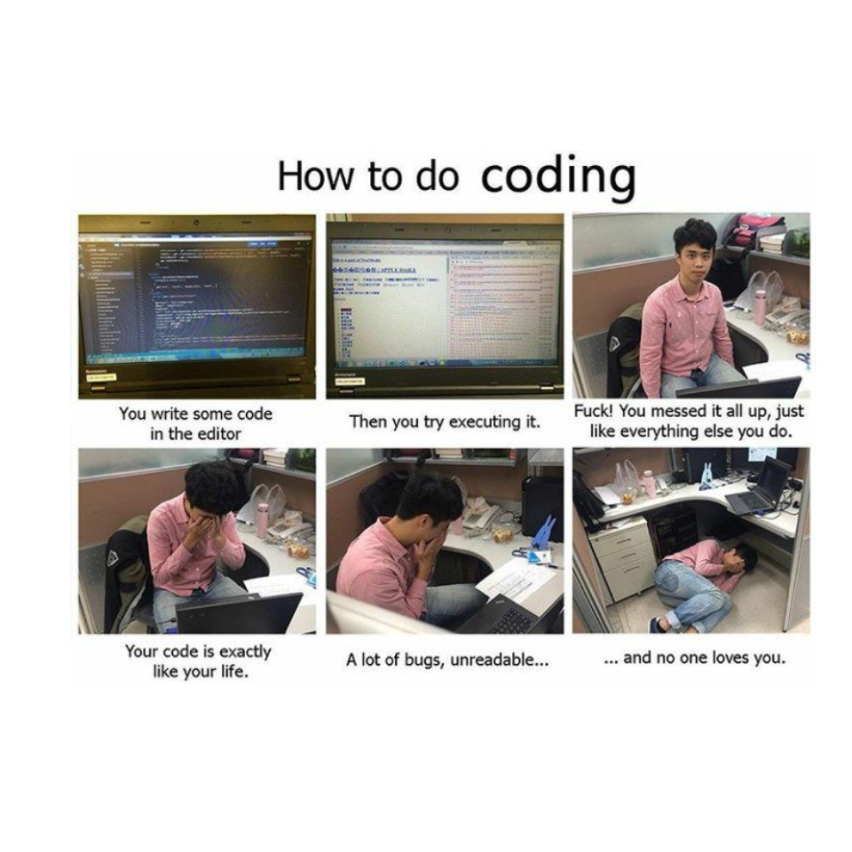

# R Memes for Statistical Fiends 

Install package from GitHub first:

``` r
devtools::install_github("favstats/rstatsmemes")
```

## Show Me an R Meme

``` r
show_me_an_R_meme(random_meme = T)
```

    ## 
    ## Choosing a random meme...

    ## 
    ## Displaying Meme #288

    ## 
    ## Likes: 117
    ## Comments: 25
    ## Shares: 9

Fan post by Charles Shaw \~
Aledro<!-- -->

## Top 3 Memes

``` r
meme_indices <- rstatsmemes::meme_posts %>% 
  mutate(likes_count = as.numeric(likes_count)) %>% 
  arrange(desc(likes_count)) %>% 
  slice(1:3) %>% 
  pull(meme_number)
```

``` r
show_me_an_R_meme(meme_indices[1])
```

    ## 
    ## Displaying Meme #176

    ## 
    ## Likes: 2196
    ## Comments: 3227
    ## Shares: 361

me sometimes tbh fam

\~Rashnutin<!-- -->

``` r
show_me_an_R_meme(meme_indices[2])
```

    ## 
    ## Displaying Meme #111

    ## 
    ## Likes: 829
    ## Comments: 771
    ## Shares: 78

Fan post \~
Aledro<!-- -->

``` r
show_me_an_R_meme(meme_indices[3])
```

    ## 
    ## Displaying Meme #163

    ## 
    ## Likes: 663
    ## Comments: 114
    ## Shares: 54

Stole this from Latex Memes For Well Typeset Teens \~
Aledro<!-- -->
