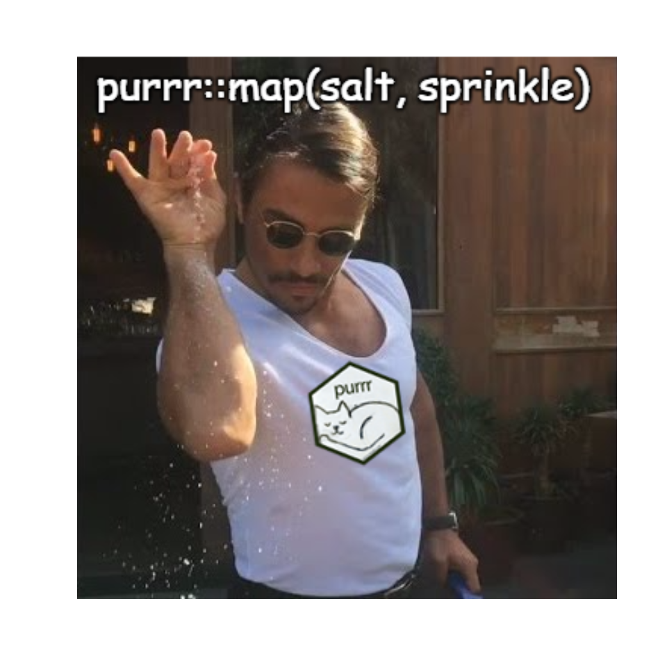

# R Memes for Statistical Fiends 

Ever wanted to have R Memes at the ready whenever you want?

*Of course not.* But here is a package that does exactly that.

## Installation

The package is easy to use.

Just install package from GitHub:

``` r
devtools::install_github("favstats/rstatsmemes")
```

## Show Me an R Meme

Let `show_me_an_R_meme` do the rest. This will plot a random R meme from
the list of all memes.

``` r
show_me_an_R_meme(random_meme = T)
```

    ## 
    ## Choosing a random meme...

    ## 
    ## Displaying Meme #82

    ## 
    ## Likes: 24
    ## Comments: 1
    ## Shares: 1

We have the best fan memes \<3
\~Rashnutin<!-- -->

Want to check out a list of all memes? You can do this here:

``` r
glimpse(rstatsmemes::meme_posts)
```

    ## Observations: 422
    ## Variables: 9
    ## $ id             <chr> "227071407345158_1456194754432811", "227071407345…
    ## $ meme_number    <int> 1, 2, 3, 4, 5, 6, 7, 8, 9, 10, 11, 12, 13, 14, 15…
    ## $ created_time   <dttm> 2017-04-02 06:48:58, 2017-04-02 06:53:46, 2017-0…
    ## $ message        <chr> NA, NA, NA, NA, NA, NA, NA, "Can't always roast S…
    ## $ story          <chr> "R Memes For Statistical Fiends updated their pro…
    ## $ full_picture   <chr> "https://scontent.xx.fbcdn.net/v/t1.0-9/17757241_…
    ## $ shares_count   <chr> NA, "1", "6", "1", "1", NA, "1", NA, NA, NA, "1",…
    ## $ likes_count    <chr> "2", "12", "14", "12", "9", "13", "4", "7", "10",…
    ## $ comments_count <chr> "0", "4", "4", "3", "4", "2", "0", "0", "0", "5",…

You can also display a specific meme by passing number from 1 to 422
(current number of memes on the Facebook page). The number refers to the
date when the meme was first posted on Facebook with 1 being the first
meme.

``` r
show_me_an_R_meme(322)
```

    ## 
    ## Displaying Meme #322

    ## 
    ## Likes: 293
    ## Comments: 43
    ## Shares: 78

based on a true story

\~Rashnutin<!-- -->

## Top 3 Memes

Here are the Top 3 liked memes on the Facebook page:

``` r
meme_indices <- meme_posts %>% 
  mutate(likes_count = as.numeric(likes_count)) %>% 
  arrange(desc(likes_count)) %>% 
  slice(1:3) %>% 
  pull(meme_number)
```

``` r
show_me_an_R_meme(meme_indices[1])
```

    ## 
    ## Displaying Meme #176

    ## 
    ## Likes: 2196
    ## Comments: 3227
    ## Shares: 361

me sometimes tbh fam

\~Rashnutin<!-- -->

``` r
show_me_an_R_meme(meme_indices[2])
```

    ## 
    ## Displaying Meme #111

    ## 
    ## Likes: 829
    ## Comments: 771
    ## Shares: 78

Fan post \~
Aledro<!-- -->

``` r
show_me_an_R_meme(meme_indices[3])
```

    ## 
    ## Displaying Meme #163

    ## 
    ## Likes: 663
    ## Comments: 114
    ## Shares: 54

Stole this from Latex Memes For Well Typeset Teens \~
Aledro<!-- -->
